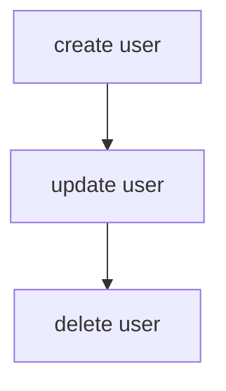

# Dependency Graph

Generate visual dependency graphs from your test files.

## CLI Usage

```bash
# Generate Mermaid diagram
npx playwright-relay graph "tests/**/*.spec.ts"

# Generate ASCII diagram
npx playwright-relay graph "tests/**/*.spec.ts" --format ascii

# Generate HTML page with interactive graph
npx playwright-relay graph "tests/**/*.spec.ts" --format html --output graph.html

# Generate JSON
npx playwright-relay graph "tests/**/*.spec.ts" --format json

# Change direction (TB, BT, LR, RL)
npx playwright-relay graph "tests/**/*.spec.ts" --direction LR
```

## Output Formats

### Mermaid (default)

```bash
npx playwright-relay graph "tests/**/*.spec.ts"
```

Output:


### ASCII

```bash
npx playwright-relay graph "tests/**/*.spec.ts" --format ascii
```

Output:
```
○ create user
● update user
  └─ depends on: create user
● delete user
  └─ depends on: update user
```

### HTML

```bash
npx playwright-relay graph "tests/**/*.spec.ts" --format html --output graph.html
```

Generates an HTML page with an interactive Mermaid diagram.

### JSON

```bash
npx playwright-relay graph "tests/**/*.spec.ts" --format json
```

Output:
```json
{
  "nodes": [
    { "id": "test.spec.ts > create user", "title": "create user", "file": "test.spec.ts" },
    { "id": "test.spec.ts > update user", "title": "update user", "file": "test.spec.ts" }
  ],
  "edges": [
    { "from": "test.spec.ts > create user", "to": "test.spec.ts > update user" }
  ]
}
```

## Programmatic Usage

```typescript
import { generateGraph, generateHtmlGraph, buildGraphFromFiles } from 'playwright-relay';

// Generate graph output
const result = generateGraph('tests/**/*.spec.ts', {
  format: 'mermaid',
  direction: 'TB',
  includeOrphans: true,
});

console.log(result.output);
console.log(`Tests: ${result.testCount}, Dependencies: ${result.dependencyCount}`);

// Generate HTML
const html = generateHtmlGraph('tests/**/*.spec.ts', {
  direction: 'LR',
});

// Build graph object for custom processing
const graph = buildGraphFromFiles(['tests/auth.spec.ts', 'tests/user.spec.ts']);
console.log(graph.toMermaid());
console.log(graph.toAscii());
```

## Graph Directions

| Direction | Description |
|-----------|-------------|
| `TB` | Top to bottom (default) |
| `BT` | Bottom to top |
| `LR` | Left to right |
| `RL` | Right to left |

## Options

| Option | Type | Default | Description |
|--------|------|---------|-------------|
| `format` | `string` | `'mermaid'` | Output format: `mermaid`, `ascii`, `json`, `html` |
| `direction` | `string` | `'TB'` | Graph direction for Mermaid |
| `includeOrphans` | `boolean` | `true` | Include tests without dependencies |
| `output` | `string` | - | Write to file instead of stdout |
